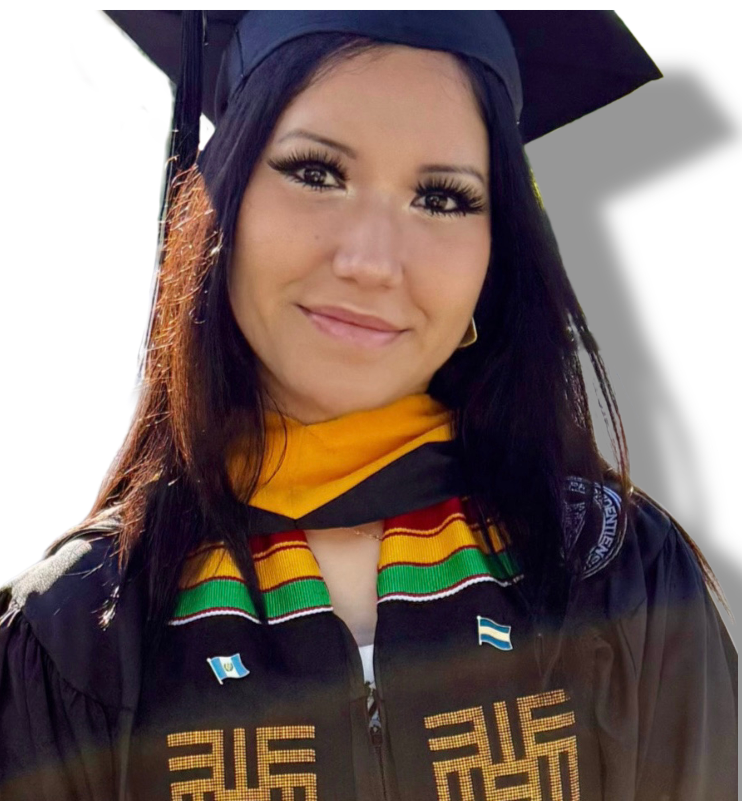

<h1 align="center">👩🏽‍🎓 Alexandra Mejia Vielman</h1>

<strong>Computer Science Graduate | Providence College Class of 2025</strong>

💻 Data & Software Enthusiast | Bilingual | Based in Rhode Island

## 🧠 About Me

I'm a recent computer science graduate passionate about using technology to solve real-world problems. I enjoy working on data analysis, software development, and collaborative projects that make an impact. I'm bilingual (English & Spanish) and value inclusive, mission-driven work environments.

---

## 🛠️ Skills

| Languages         | Tools & Libraries         | Concepts                               |
|------------------|---------------------------|----------------------------------------|
| Python, C++, R, SQL | Tableau, Power BI, Git, VS Code | Data Analysis, Algorithms, Web Development, Databases, Computer Architecture |

---

## 📁 Projects

### 📊 **Project Name**
> 💬 *Brief summary of what the project does, what tech you used, and what you learned.*

- **Tech Used:** Python, SQL, Pandas  
- **GitHub Repo:** [🔗 Link Here](#)

---

### 🤖 **Another Project**
> 💬 *Include a short 1–2 line description of your second project here.*

- **Tech Used:** JavaScript, HTML/CSS  
- **GitHub Repo:** [🔗 Link Here](#)

---

## 📬 Contact

- 📧 **Email:** your.email@example.com  
- 💼 **LinkedIn:** [linkedin.com/in/yourprofile](#)  
- 🌐 **Portfolio:** [amejiavielman.github.io](#)

---

“Technology is best when it brings people together.” – Matt Mullenweg

